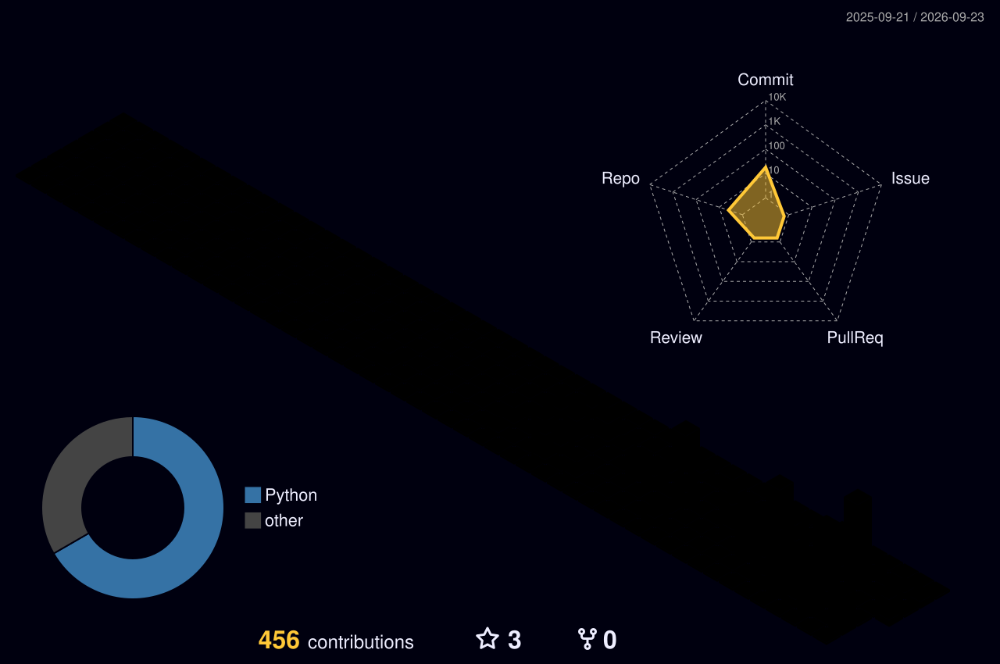

# Daniel Junior

### Engenheiro de IA

**Visão computacional · Inferência local de modelos · Automação de processos**

---

## Sobre

Pego processo manual, caro e sujeito a erro, e devolvo uma solução de IA que roda sozinha, em produção, com rastreabilidade.

Meu foco é engenharia de IA aplicada: visão computacional em ambiente real, inferência local de modelos (rodar LLM e visão dentro de casa em vez de na API de outra pessoa) e automação que integra sistemas que não conversavam.

Trabalho na fronteira entre processo, dado e modelo. Antes de escrever a primeira linha de código eu entendo a regra de negócio, e é por isso que as soluções continuam rodando depois que eu entrego.

Especialização em Inteligência Artificial Aplicada pela **UFPR**.

---

## No que eu trabalho

| Área | O que faço |
|---|---|
| **Visão computacional** | Identificação facial 1:N, embeddings em banco vetorial, avaliação em conjunto aberto (FPIR, FNIR, rank-1) |
| **Inferência local** | LLMs e modelos de visão em GPU própria, com foco em custo, latência e controle do dado |
| **Agentes e LLMs** | Agentes integrados a CRM, WhatsApp e sistemas internos |
| **Dados e automação** | Pipelines, detecção de inconsistências, integração de sistemas via API |

---

## Stack

**IA e dados**

**Backend e infra**

**Frontend e mobile**

---

## Contribuições

---

## Projetos

| Projeto | Descrição | Resultado |
|---|---|---|
| [**CarPricePredict**](https://github.com/danieldevbel/CarPricePredict) | Pipeline completo de previsão de preços de veículos no Brasil, da coleta à modelagem | R² de 0,9797 com Random Forest e XGBoost |
| [**analise_salarios_ti**](https://github.com/danieldevbel/analise_salarios_ti) | Análise de equidade salarial em empresa de tecnologia, por gênero, senioridade e experiência | Pipeline de análise e visualização em Python |

---

**Tem um problema de visão computacional, ou quer IA rodando dentro de casa?**

